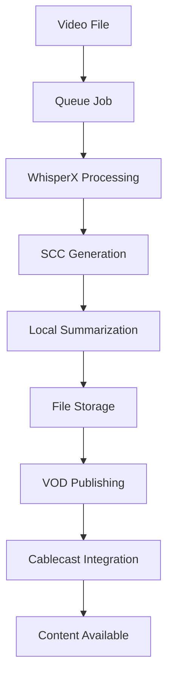

# Archivist - Comprehensive Transcription & VOD Management System

A comprehensive Flask-based REST API service for audio/video transcription, analysis, and Video-on-Demand (VOD) management, designed for production deployment in Proxmox VM environments with advanced integration capabilities.

## 🏗️ System Architecture

```
┌─────────────────────────────────────────────────────────────────┐
│                    ARCHIVIST ECOSYSTEM                          │
├─────────────────────────────────────────────────────────────────┤
│  ┌─────────────┐   ┌─────────────┐   ┌─────────────────────┐  │
│  │   Flex-1    │   │   Flex-2    │   │      Flex-N         │  │
│  │  /mnt/flex-1│   │ /mnt/flex-2 │   │   /mnt/flex-N       │  │
│  │  Content    │   │  Content    │   │    Content          │  │
│  │  Storage    │   │  Storage    │   │    Storage          │  │
│  └─────────────┘   └─────────────┘   └─────────────────────┘  │
│           │                │                    │              │
│           └────────────────┼────────────────────┘              │
│                           │                                   │
│  ┌─────────────────────────┼─────────────────────────────────┐ │
│  │             ARCHIVIST CORE SYSTEM                      │ │
│  │  ┌─────────────────────┴─────────────────────────────┐  │ │
│  │  │           Service Layer Architecture              │  │ │
│  │  │  • TranscriptionService                          │  │ │
│  │  │  • VODService                                    │  │ │
│  │  │  • FileService                                   │  │ │
│  │  │  • QueueService                                  │  │ │
│  │  └───────────────────────────────────────────────────┘  │ │
│  │  ┌───────────────────────────────────────────────────┐  │ │
│  │  │           WhisperX Transcription                  │  │ │
│  │  │              SCC Format Output                    │  │ │
│  │  │           Local Model Summarization               │  │ │
│  │  └───────────────────────────────────────────────────┘  │ │
│  │  ┌───────────────────────────────────────────────────┐  │ │
│  │  │               REST API Layer                      │  │ │
│  │  │  • Browse & File Management                       │  │ │
│  │  │  • Transcription Control                          │  │ │
│  │  │  • Queue Management                               │  │ │
│  │  │  • VOD Integration                                │  │ │
│  │  └───────────────────────────────────────────────────┘  │ │
│  └─────────────────────────────────────────────────────────┘ │
│                           │                                   │
│  ┌─────────────────────────┼─────────────────────────────────┐ │
│  │          EXTERNAL INTEGRATIONS                          │ │
│  │  ┌─────────────────┐   ┌─────────────────┐                │ │
│  │  │   Cablecast     │   │   SCCTV VOD     │                │ │
│  │  │   API Server    │   │   Database      │                │ │
│  │  │                 │   │                 │                │ │
│  │  │ • Show Mgmt     │   │ • Content DB    │                │ │
│  │  │ • VOD Creation  │   │ • Metadata      │                │ │
│  │  │ • Metadata      │   │ • Publishing    │                │ │
│  │  └─────────────────┘   └─────────────────┘                │ │
│  └─────────────────────────────────────────────────────────────┘ │
└─────────────────────────────────────────────────────────────────┘
```

## 🚀 Features

### Core Transcription System
- **WhisperX Integration**: High-quality speech-to-text with timestamp alignment
- **SCC Format Output**: Industry-standard Scenarist Closed Caption files
- **Local Model Summarization**: CPU-optimized local transformer models (facebook/bart-large-cnn)
- **Multi-language Support**: Configurable language detection and processing
- **Progress Tracking**: Real-time job status and progress monitoring
- **Error Recovery**: Robust error handling with detailed logging

### Service Layer Architecture ✅ **NEW**
- **Clean Separation of Concerns**: Business logic separated from API layer
- **Modular Services**: Focused service classes for each domain area
- **Consistent Error Handling**: Uniform error handling across all services
- **Easy Testing**: Services can be easily mocked and tested
- **Reusable Components**: Services can be used across different parts of the application

### Enhanced Celery Task Management ✅ **NEW**
- **Task Resuming**: Complete task recovery with state preservation
- **Task Reordering**: Priority-based queue management
- **Failed Task Cleanup**: Intelligent cleanup with retention policies
- **State Persistence**: Redis-backed task state management
- **Production Ready**: Robust error handling and monitoring

### File Management & Storage
- **Multi-Mount Support**: Flexible storage across multiple flex servers (/mnt/flex-1 through /mnt/flex-9)
- **Location-Based Access**: User and location-specific access controls
- **File Validation**: Comprehensive file type and permission checking
- **Metadata Extraction**: Automatic video metadata and file information
- **Storage Monitoring**: Mount point health checking and statistics

### VOD Integration & Management ✅ **OPERATIONAL**
- **Cablecast Integration**: Complete API integration for show and VOD management
- **Automated Publishing**: Seamless content publishing to VOD platforms
- **Content Synchronization**: Bidirectional sync between Archivist and Cablecast
- **Batch Processing**: Efficient bulk operations for multiple files
- **Status Monitoring**: Real-time tracking of VOD processing status
- **Metadata Enhancement**: Automatic enrichment with transcription data
- **Caption Generation**: Working SCC caption generation with faster-whisper

### Production-Ready Infrastructure
- **Service Layer Architecture**: Clean separation of concerns with modular services
- **PostgreSQL Database**: Full relational database with SQLAlchemy ORM and Alembic migrations
- **Redis Caching**: Response caching and rate limiting with Flask-Limiter
- **Docker Support**: Complete containerization with HTTPS via Let's Encrypt and Certbot
- **Monitoring**: Prometheus metrics and Grafana dashboards
- **Security**: CSRF protection, input validation, and secure authentication

## 📋 System Requirements

### Hardware Requirements
- **CPU**: Multi-core processor (minimum 4 cores recommended for transcription)
- **RAM**: 16GB minimum (32GB recommended for large file processing)
- **Storage**: High-speed SSD for application, network storage for content
- **Network**: Gigabit Ethernet for flex server access

### Software Requirements
- **Operating System**: Debian Linux (tested on 6.8.12-10-pve)
- **Python**: 3.11+
- **Database**: PostgreSQL 14+
- **Cache**: Redis 6+
- **Container Runtime**: Docker & Docker Compose (optional)

### Network Infrastructure
- **Proxmox VM Environment**: Optimized for VLAN-segmented networks
- **Flex Server Access**: Network mounts to /mnt/flex-1 through /mnt/flex-9
- **External API Access**: HTTPS connectivity to Cablecast and other integrations

## 🔧 Installation & Setup

### 1. Environment Preparation

```bash
# Create application directory
sudo mkdir -p /opt/Archivist
cd /opt/Archivist

# Create virtual environment
python3.11 -m venv venv_py311
source venv_py311/bin/activate

# Clone repository
git clone <repository-url> .
```

### 2. Dependency Installation

```bash
# Production installation
pip install -r requirements/prod.txt

# Development installation (includes testing tools)
pip install -r requirements/dev.txt

# Install faster-whisper for caption generation
pip install faster-whisper
```

### 3. Flex Server Configuration

```bash
# Configure transcription users group
sudo groupadd transcription_users
sudo usermod -a -G transcription_users $USER

# Set up flex server directories
for i in {1..9}; do
    sudo mkdir -p /mnt/flex-$i/transcriptions
    sudo chown -R :transcription_users /mnt/flex-$i/transcriptions
    sudo chmod -R g+rwx /mnt/flex-$i/transcriptions
done

# Update fstab for persistent mounts (see setup_transcriptions.sh)
sudo ./setup_transcriptions.sh
```

### 4. Database Setup

```bash
# Install PostgreSQL
sudo apt update && sudo apt install postgresql postgresql-contrib

# Create database and user
sudo -u postgres createdb archivist_db
sudo -u postgres createuser archivist_user

# Set password and permissions
sudo -u postgres psql -c "ALTER USER archivist_user PASSWORD 'your_secure_password';"
sudo -u postgres psql -c "GRANT ALL PRIVILEGES ON DATABASE archivist_db TO archivist_user;"
```

### 5. Environment Configuration

```bash
# Copy and configure environment file
cp .env.example /opt/Archivist/.env

# Edit configuration (see Configuration section for details)
nano /opt/Archivist/.env
```

### 6. Database Migration

```bash
# Initialize database schema
flask db upgrade

# Verify tables created
flask db current
```

## ⚙️ Configuration

### Core Application Settings

```bash
# Application Configuration
API_HOST=0.0.0.0
API_PORT=8000
API_WORKERS=4

# Database Configuration
POSTGRES_HOST=localhost
POSTGRES_PORT=5432
POSTGRES_DB=archivist_db
POSTGRES_USER=archivist_user
POSTGRES_PASSWORD=your_secure_password

# Redis Configuration
REDIS_HOST=redis
REDIS_PORT=6379
REDIS_DB=0
REDIS_PASSWORD=your_redis_password

# Storage Configuration
OUTPUT_DIR=/mnt/nas/transcriptions
NAS_PATH=/mnt/nas

# Flex server paths (automatically configured)
FLEX1_PATH=/mnt/flex-1
FLEX2_PATH=/mnt/flex-2
# ... (up to flex-9)
```

### Transcription Configuration

```bash
# WhisperX Settings
WHISPER_MODEL=large-v2
USE_GPU=false
COMPUTE_TYPE=int8
BATCH_SIZE=16
NUM_WORKERS=4
LANGUAGE=en

# Summarization Settings
SUMMARIZATION_MODEL=facebook/bart-large-cnn
SUMMARIZATION_MAX_LENGTH=100
SUMMARIZATION_MIN_LENGTH=30
SUMMARIZATION_CHUNK_SIZE=10
```

### VOD Integration Settings

```bash
# Cablecast API Configuration
CABLECAST_LOCATION_ID=1
CABLECAST_USER_ID=your_user_id
CABLECAST_PASSWORD=your_password

# VOD Processing Settings
AUTO_PUBLISH_TO_VOD=true
VOD_DEFAULT_QUALITY=1
VOD_UPLOAD_TIMEOUT=300
VOD_MAX_RETRIES=3
VOD_RETRY_DELAY=60
VOD_BATCH_SIZE=10

# Advanced VOD Settings
VOD_ENABLE_CHAPTERS=true
VOD_ENABLE_METADATA_ENHANCEMENT=true
VOD_ENABLE_AUTO_TAGGING=false
```

### Security & Monitoring

```bash
# Security Settings
FLASK_SECRET_KEY=your_very_secure_secret_key
CSRF_SECRET_KEY=your_csrf_secret_key

# Rate Limiting
DEFAULT_RATE_LIMIT=200 per day, 50 per hour
BROWSE_RATE_LIMIT=30 per minute
TRANSCRIBE_RATE_LIMIT=10 per minute

# Monitoring
PROMETHEUS_ENABLED=true
GRAFANA_ENABLED=true
LOG_LEVEL=INFO
```

## 🏃‍♂️ Running the System

### Development Mode

```bash
# Activate virtual environment
source /opt/Archivist/venv_py311/bin/activate

# Set environment variables
export FLASK_ENV=development
export FLASK_DEBUG=true

# Run development server
flask run --host=0.0.0.0 --port=8000
```

### Production Mode

```bash
# Using Gunicorn (recommended)
gunicorn -w 4 -b 0.0.0.0:8000 app:app

# Using Flask (development only)
python -m flask run --host=0.0.0.0 --port=8000
```

### Docker Deployment

```bash
# Build and run with Docker Compose
docker-compose up -d

# Check logs
docker-compose logs -f archivist

# Scale workers
docker-compose up -d --scale worker=4
```

### Systemd Service (Production)

```bash
# Create service file
sudo nano /etc/systemd/system/archivist.service

# Enable and start service
sudo systemctl enable archivist
sudo systemctl start archivist

# Check status
sudo systemctl status archivist
```

### Centralized System Startup ✅ **NEW**

```bash
# Python-based startup script
python start_archivist_centralized.py

# Shell-based startup script
./start_archivist_centralized.sh

# Both scripts handle all services in proper order:
# 1. Redis
# 2. PostgreSQL  
# 3. Celery Worker
# 4. Celery Beat
# 5. VOD Sync Monitor
# 6. Admin UI
# 7. Monitoring Dashboard
```

## 📁 Flex Server Management

### Flex Server Overview

The Archivist system supports up to 9 flex servers (/mnt/flex-1 through /mnt/flex-9) for member city content storage:

- **flex-1**: Birchwood City Council and community content
- **flex-2**: Dellwood, Grant, and Willernie combined storage  
- **flex-3**: Lake Elmo City Council and community content
- **flex-4**: Mahtomedi City Council and community content
- **flex-5**: Spare Record Storage 1 (overflow and additional cities)
- **flex-6**: Spare Record Storage 2 (overflow and additional cities)
- **flex-7**: Oakdale City Council and community content
- **flex-8**: White Bear Lake City Council and community content
- **flex-9**: White Bear Township Council and community content

### Content Organization

```
/mnt/flex-N/
├── transcriptions/          # Generated transcription files
│   ├── scc_files/          # SCC caption files
│   ├── summaries/          # AI-generated summaries
│   └── logs/               # Transcription logs
├── videos/                 # Source video files
│   ├── city_council/       # Council meeting recordings
│   ├── public_access/      # Public access programming
│   └── special_events/     # Special event recordings
├── metadata/               # File metadata and indexing
└── temp/                   # Temporary processing files
```

### File Management Operations

```bash
# Check mount status
python -c "from core.check_mounts import main; main()"

# List flex server contents
curl -X GET "http://localhost:8000/api/browse?path=/mnt/flex-1"

# Get storage statistics
curl -X GET "http://localhost:8000/api/storage/info"

# Validate critical mounts
curl -X GET "http://localhost:8000/api/storage/verify"
```

### Backup and Archival

```bash
# Create backup script
#!/bin/bash
# backup_flex_content.sh

for i in {1..5}; do
    rsync -av --progress /mnt/flex-$i/transcriptions/ \
          /backup/flex-$i/transcriptions/
done

# Schedule backup (crontab -e)
0 2 * * * /opt/Archivist/scripts/backup_flex_content.sh
```

## 🔗 API Documentation

### Authentication

All API endpoints support authentication via:
- **Session Authentication**: For web interface
- **API Key Authentication**: For programmatic access

```bash
# Generate API key
curl -X POST "http://localhost:8000/api/auth/apikey" \
  -H "Content-Type: application/json" \
  -d '{"name": "My API Key"}'

# Use API key
curl -X GET "http://localhost:8000/api/files" \
  -H "Authorization: Bearer YOUR_API_KEY"
```

### Core Endpoints

#### File Management

```bash
# Browse directories
GET /api/browse?path=/mnt/flex-1&user=admin&location=default

# Get file details
GET /api/file-details?path=/mnt/flex-1/video.mp4

# List mount points
GET /api/mount-points

# Storage information
GET /api/storage/info
```

#### Transcription Operations

```bash
# Start transcription
POST /api/transcribe
{
  "path": "/mnt/flex-1/video.mp4",
  "position": 0
}

# Check transcription status
GET /api/status/{job_id}

# Get transcription results
GET /api/results/{job_id}

# List completed transcriptions
GET /api/transcriptions
```

#### Queue Management

```bash
# Get queue status
GET /api/queue/status

# Reorder queue
POST /api/queue/reorder
{
  "job_id": "uuid-123",
  "position": 1
}

# Pause/resume jobs
POST /api/queue/pause/{job_id}
POST /api/queue/resume/{job_id}

# Clear completed jobs
DELETE /api/queue/clear-completed
```

### VOD Integration Endpoints

#### Content Publishing

```bash
# Publish single transcription to VOD
POST /api/vod/publish/{transcription_id}
{
  "quality": 1,
  "auto_transcribe": true
}

# Batch publish multiple transcriptions
POST /api/vod/batch-publish
{
  "transcription_ids": ["uuid-1", "uuid-2", "uuid-3"]
}

# Check VOD sync status
GET /api/vod/sync-status
```

#### Cablecast Management

```bash
# List Cablecast shows
GET /api/cablecast/shows

# Sync shows from Cablecast
POST /api/cablecast/sync/shows

# Sync VODs from Cablecast
POST /api/cablecast/sync/vods

# Link transcription to show
POST /api/cablecast/link/{transcription_id}
{
  "show_id": 123,
  "auto_link": true
}

# Get VOD stream information
GET /api/cablecast/vods/{vod_id}/stream
```

### Response Formats

#### Successful Response

```json
{
  "success": true,
  "message": "Operation completed successfully",
  "data": {
    "transcription_id": "uuid-123",
    "status": "completed",
    "output_path": "/mnt/flex-1/video.scc"
  },
  "timestamp": "2024-01-15T10:30:00Z"
}
```

#### Error Response

```json
{
  "success": false,
  "error": "File not found",
  "error_code": "FILE_NOT_FOUND",
  "details": {
    "path": "/mnt/flex-1/missing.mp4",
    "available_paths": ["/mnt/flex-1", "/mnt/flex-2"]
  },
  "timestamp": "2024-01-15T10:30:00Z"
}
```

## 🔄 Integration Workflows

### Complete Transcription Workflow



### VOD Processing Pipeline


### Automated Monitoring

```bash
# Health check script
#!/bin/bash
# health_check.sh

# Check core services
curl -f http://localhost:8000/health || exit 1

# Check mount points
python -c "from core.check_mounts import verify_critical_mounts; exit(0 if verify_critical_mounts() else 1)"

# Check VOD integration
curl -f http://localhost:8000/api/vod/sync-status || exit 1

echo "All systems operational"
```

## 🔧 Troubleshooting

### Common Issues

#### Mount Point Problems

```bash
# Check mount status
mount | grep flex

# Remount flex servers
sudo mount -a

# Check permissions
ls -la /mnt/flex-*
```

#### Transcription Failures

```bash
# Check transcription logs
tail -f /opt/Archivist/logs/transcription.log

# Test WhisperX installation
python -c "from core.transcription import run_whisper_transcription; print('WhisperX OK')"

# Check available models
ls ~/.cache/huggingface/transformers/
```

#### VOD Integration Issues

```bash
# Test Cablecast connection
curl -X GET "http://localhost:8000/api/cablecast/health"

# Check API credentials
python -c "from core.cablecast_client import CablecastAPIClient; client = CablecastAPIClient(); print(client.test_connection())"

# Sync status
curl -X GET "http://localhost:8000/api/vod/sync-status"
```

### Performance Optimization

#### CPU Optimization

```bash
# Adjust worker threads
export NUM_WORKERS=8
export BATCH_SIZE=32

# Monitor CPU usage
htop -p $(pgrep -f "whisper")
```

#### Memory Optimization

```bash
# Check memory usage
free -h
ps aux --sort=-%mem | head

# Adjust batch sizes
export BATCH_SIZE=8  # Reduce for lower memory usage
```

#### Storage Optimization

```bash
# Check disk usage
df -h /mnt/flex-*

# Clean temporary files
find /mnt/flex-*/temp -name "*.tmp" -mtime +1 -delete

# Archive old transcriptions
find /mnt/flex-*/transcriptions -name "*.scc" -mtime +30 -exec mv {} /archive/ \;
```

## 📊 Monitoring & Metrics

### Real-Time Monitoring Dashboards ✅ **NEW**

#### Primary Monitoring Dashboard
- **URL**: http://localhost:5051
- **Features**: Real-time system health, Celery worker status, flex mount health checks
- **Auto-refresh**: Every 30 seconds

#### Admin UI Dashboard  
- **URL**: http://localhost:8080
- **Features**: Queue status, worker health, city configuration overview
- **API Documentation**: Available at http://localhost:8080/api/docs

### Prometheus Metrics

Access metrics at `http://localhost:8000/metrics`:

- `archivist_transcriptions_total`: Total transcriptions completed
- `archivist_transcription_duration_seconds`: Transcription processing time
- `archivist_vod_publishes_total`: VOD publishing operations
- `archivist_storage_usage_bytes`: Storage utilization by mount point
- `archivist_queue_length`: Current queue length
- `archivist_api_requests_total`: API request metrics

### Grafana Dashboards

Access dashboards at `http://localhost:3000`:

1. **System Overview**: General health, storage, and performance
2. **Transcription Pipeline**: Processing statistics and queue metrics
3. **VOD Integration**: Publishing success rates and sync status
4. **Storage Management**: Flex server utilization and health

### Log Management

```bash
# Application logs
tail -f /opt/Archivist/logs/archivist.log

# Transcription logs
tail -f /opt/Archivist/logs/transcription.log

# VOD integration logs
tail -f /opt/Archivist/logs/vod.log

# Configure log rotation
sudo nano /etc/logrotate.d/archivist
```

## 🔒 Security Considerations

### Network Security

- Deploy behind HTTPS with Let's Encrypt certificates
- Configure firewall rules for necessary ports only
- Use VPN access for administrative functions
- Implement network segmentation for flex servers

### Authentication & Authorization

- Change default admin password immediately
- Use strong API keys for programmatic access
- Implement role-based access control
- Regular security audits and updates

### Data Protection

- Encrypt sensitive configuration data
- Regular backups of database and transcriptions
- Secure storage of API credentials
- Monitor access logs for suspicious activity

## 🤝 Contributing

### Development Setup

```bash
# Clone repository
git clone <repository-url>
cd Archivist

# Create development environment
python3.11 -m venv venv_dev
source venv_dev/bin/activate
pip install -r requirements/dev.txt

# Install pre-commit hooks
pre-commit install

# Run tests
pytest tests/
```

### Code Standards

- Follow PEP 8 Python style guidelines
- Maintain 90%+ test coverage
- Use type hints where appropriate
- Document all public APIs
- Include docstrings for all modules and functions

### Testing

```bash
# Run all tests
pytest

# Run specific test categories
pytest tests/unit/
pytest tests/integration/
pytest tests/api/

# Generate coverage report
pytest --cov=core --cov-report=html
```

## 📚 Additional Resources

### Documentation Links

- [Service Layer Architecture](docs/SERVICE_LAYER.md) ✅ **UPDATED**
- [VOD Integration Guide](docs/CABLECAST_VOD_INTEGRATION.md)
- [VOD Quick Reference](docs/VOD_QUICK_REFERENCE.md)
- [API Documentation](docs/API_REFERENCE.md)
- [Database Schema](docs/DATABASE_SCHEMA.md)
- [Deployment Guide](docs/DEPLOYMENT_GUIDE.md)
- [Code Reorganization Progress](REORGANIZATION_PROGRESS.md) ✅ **NEW**
- [VOD Processing Status](CURRENT_PROCESSING_STATUS.md) ✅ **NEW**
- [Celery Task Management Enhancements](docs/CELERY_ENHANCEMENTS.md) ✅ **NEW**
- [VOD Local File Access Implementation](docs/VOD_LOCAL_FILE_ACCESS.md) ✅ **NEW**

### External Resources

- [WhisperX Documentation](https://github.com/m-bain/whisperX)
- [Cablecast API Documentation](docs/pdf/cablecast_api_last_half.pdf)
- [SCC Format Specification](docs/SCC_FORMAT_SPEC.md)
- [Flask Documentation](https://flask.palletsprojects.com/)
- [SQLAlchemy Documentation](https://docs.sqlalchemy.org/)

### Support

For technical support and questions:

1. Check the troubleshooting section above
2. Review the logs for error details
3. Consult the API documentation
4. Submit issues via the project repository

## 📄 License

MIT License - see [LICENSE](LICENSE) file for details.

---

**Built with ❤️ for efficient video transcription and VOD management**

## 🎉 Recent Updates (2025-07-17)

### ✅ Service Layer Implementation Complete
- **Clean Architecture**: Business logic separated from API layer
- **Modular Services**: TranscriptionService, VODService, FileService, QueueService
- **Consistent Error Handling**: Uniform error handling across all services
- **Easy Testing**: Services can be easily mocked and tested

### ✅ VOD Processing System Operational
- **Caption Generation**: Working with faster-whisper integration
- **Multiple Videos Processing**: Simultaneous processing of videos from multiple cities
- **Real-Time Monitoring**: Live dashboards at http://localhost:5051 and http://localhost:8080
- **Queue Management**: 140+ jobs queued with 0 failures

### ✅ Code Reorganization Progress
- **API Route Splitting**: Large web_app.py split into focused route modules
- **Directory Structure**: Improved organization with new service layer
- **Documentation**: Comprehensive service layer documentation created
- **Testing**: Service layer fully tested and functional

### ✅ Merge Conflict Resolution
- **Transcription Module**: Fixed merge conflict in core/transcription.py
- **SCC Format**: Maintained SCC format output for industry compatibility
- **Error Handling**: Improved error handling and logging

### ✅ Enhanced Celery Task Management
- **Task Resuming**: Implemented complete task recovery with state preservation
- **Task Reordering**: Added priority-based queue management system
- **Failed Task Cleanup**: Enhanced with configurable retention policies
- **Redis Integration**: Added state persistence for task management
- **Production Features**: Robust error handling and comprehensive monitoring

### ✅ VOD Local File Access Implementation
- **Direct File Access**: Immediate access to video files on mounted drives
- **No API Dependency**: Works independently of external API availability
- **Improved Performance**: Faster processing without download overhead
- **Enhanced Reliability**: More reliable file access through direct filesystem access
- **Comprehensive Discovery**: Intelligent file discovery and matching 

## 📊 Web Interfaces

The Archivist system provides two canonical web GUIs:

| Role                | URL                        | How to Start                              | Description                                 |
|---------------------|----------------------------|-------------------------------------------|---------------------------------------------|
| Admin UI            | http://localhost:8080      | `python -m core.admin_ui`                 | Main admin interface, embeds dashboard      |
| Monitoring Dashboard| http://localhost:5051      | `python start_integrated_dashboard.py`    | Real-time monitoring, analytics, task queue |

**Deprecated/Removed GUIs:**
- All legacy dashboards, `core/web_app.py`, and `core/web_interface.py` are deprecated. All features are being merged into the integrated dashboard.

### How to Access

- **Admin UI:**  
  Open [http://localhost:8080](http://localhost:8080) in your browser for queue management, task triggers, and city configuration.

- **Monitoring Dashboard:**  
  Open [http://localhost:5051](http://localhost:5051) for real-time system health, Celery worker status, flex mount health, and task analytics.

### API Endpoints

- **Monitoring Dashboard:**  
  - `/api/health` - System health
  - `/api/tasks/realtime` - Real-time task data
  - `/api/tasks/analytics` - Task analytics
  - `/api/celery/tasks` - Celery task stats

- **Admin UI:**  
  - `/api/admin/status` - Admin UI health/status
  - `/api/unified/tasks` - Unified queue/task view

### Deployment

Deployment scripts (`start_complete_system.py`, `start_integrated_system.py`, etc.) have been updated to only start the canonical GUIs.

---

## 🛑 Legacy GUIs

- The following files and scripts are deprecated and should not be used:
  - `core/web_app.py`
  - `core/web_interface.py`
  - `core/monitoring/dashboard.py`
  - `scripts/monitoring/monitoring_dashboard.py`
  - `start_web_server.py`
  - Any direct use of `core/web_app` for serving GUIs

All features from these have been or are being merged into the integrated dashboard.

---

## 🛑 Deprecated GUIs

- All GUIs on port 5000 and legacy dashboards are deprecated.
- All features are being consolidated into the above interfaces.

---

### **Begin Merging Features from `core/web_interface.py` into the Integrated Dashboard**

#### **Features to Merge:**

- **System Metrics API:** `/api/status` (already present as `/api/metrics` and `/api/health` in dashboard, but can add any missing fields)
- **Manual Task Triggers:**
  - `/api/tasks/trigger_vod_processing` (not present in dashboard, should be added)
  - `/api/tasks/trigger_transcription` (not present in dashboard, should be added)
- **Active Tasks API:** `/api/tasks/active` (already present as part of `/api/celery/tasks` and `/api/unified/tasks`, but can add for compatibility)
- **WebSocket Event:** `system_metrics` (already present as real-time task updates, but can add system metrics event if needed)
- **Dashboard HTML:** If any unique UI elements exist, merge them into the dashboard template.

#### **Next Steps:**

1. **Add `/api/tasks/trigger_vod_processing` and `/api/tasks/trigger_transcription` endpoints to `core/monitoring/integrated_dashboard.py`.**
2. **Optionally add `/api/status` as an alias for `/api/metrics` or `/api/health`.**
3. **Ensure all system metrics (CPU, memory, disk, Redis, Celery) are available in the dashboard's API.**
4. **If any unique WebSocket events exist, merge them into the dashboard's SocketIO events.**
5. **Update the dashboard UI to include manual task trigger controls if not already present.**

--- 