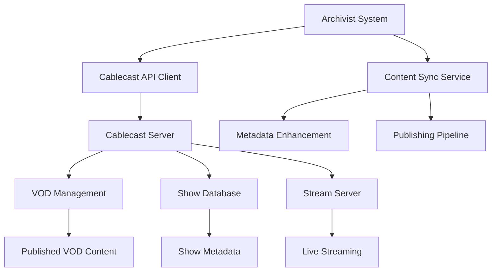

# Integration Guide

Comprehensive guide for integrating Archivist with external systems including Cablecast, VOD platforms, and other third-party services.

## 🔗 Integration Overview

### Supported Integrations

1. **Cablecast API Integration**
   - Show management and synchronization
   - VOD content publishing
   - Metadata enhancement
   - Automated workflows

2. **SCCTV VOD Database Integration**
   - Content publishing pipeline
   - Metadata synchronization
   - Access control management
   - Performance analytics

3. **External System Integrations**
   - Webhook-based notifications
   - REST API endpoints
   - Authentication systems
   - Monitoring platforms

## 🎬 Cablecast Integration

### Architecture Overview



### API Configuration

#### Connection Setup

```python
# /opt/Archivist/core/cablecast_client.py
from cablecast_api import CablecastAPIClient

class CablecastIntegration:
    def __init__(self):
        self.client = CablecastAPIClient(
            base_url=os.getenv('CABLECAST_API_URL'),
            api_key=os.getenv('CABLECAST_API_KEY'),
            location_id=os.getenv('CABLECAST_LOCATION_ID'),
            timeout=int(os.getenv('CABLECAST_TIMEOUT', 300))
        )
    
    def test_connection(self):
        """Test Cablecast API connection"""
        try:
            response = self.client.get_server_info()
            return response.get('status') == 'ok'
        except Exception as e:
            logger.error(f"Cablecast connection test failed: {e}")
            return False
```

#### Environment Configuration

```bash
# Cablecast API Configuration
CABLECAST_API_URL=https://your-cablecast-server.com/api
CABLECAST_API_KEY=your_api_key_here
CABLECAST_LOCATION_ID=1
CABLECAST_USER_ID=your_user_id
CABLECAST_PASSWORD=your_password
CABLECAST_TIMEOUT=300
CABLECAST_MAX_RETRIES=3
CABLECAST_RETRY_DELAY=60
```

### Show Management Integration

#### Show Synchronization

```python
def sync_shows_from_cablecast(self):
    """Synchronize shows from Cablecast to Archivist"""
    try:
        # Get shows from Cablecast
        shows_response = self.client.get_shows(
            location_id=self.location_id,
            limit=100
        )
        
        for show_data in shows_response.get('shows', []):
            # Create or update show in Archivist database
            show = self.create_or_update_show(show_data)
            
            # Sync associated metadata
            self.sync_show_metadata(show, show_data)
            
            logger.info(f"Synced show: {show.title}")
            
    except Exception as e:
        logger.error(f"Show synchronization failed: {e}")
        raise
```

#### Show Metadata Management

```python
def create_or_update_show(self, show_data):
    """Create or update show in Archivist database"""
    show_id = show_data.get('id')
    
    show = Show.query.filter_by(cablecast_id=show_id).first()
    
    if not show:
        show = Show(cablecast_id=show_id)
        db.session.add(show)
    
    # Update show attributes
    show.title = show_data.get('title', '')
    show.description = show_data.get('description', '')
    show.category = show_data.get('category', '')
    show.producer = show_data.get('producer', '')
    show.runtime = show_data.get('runtime', 0)
    show.created_date = parse_datetime(show_data.get('created_date'))
    show.updated_date = datetime.utcnow()
    
    db.session.commit()
    return show
```

### VOD Publishing Integration

#### Publishing Pipeline

```python
def publish_transcription_to_vod(self, transcription_id, vod_settings=None):
    """Publish completed transcription to VOD platform"""
    try:
        transcription = Transcription.query.get(transcription_id)
        if not transcription:
            raise ValueError(f"Transcription not found: {transcription_id}")
        
        # Prepare VOD content
        vod_content = self.prepare_vod_content(transcription, vod_settings)
        
        # Upload to Cablecast
        vod_response = self.client.create_vod(
            title=vod_content['title'],
            description=vod_content['description'],
            file_path=vod_content['file_path'],
            metadata=vod_content['metadata']
        )
        
        # Update transcription with VOD information
        transcription.vod_id = vod_response.get('id')
        transcription.vod_url = vod_response.get('url')
        transcription.vod_status = 'published'
        transcription.vod_published_date = datetime.utcnow()
        
        db.session.commit()
        
        logger.info(f"Published transcription {transcription_id} to VOD")
        return vod_response
        
    except Exception as e:
        logger.error(f"VOD publishing failed: {e}")
        raise
```

#### Batch Publishing

```python
def batch_publish_to_vod(self, transcription_ids, batch_settings=None):
    """Publish multiple transcriptions to VOD"""
    results = []
    
    for transcription_id in transcription_ids:
        try:
            result = self.publish_transcription_to_vod(
                transcription_id, 
                batch_settings
            )
            results.append({
                'transcription_id': transcription_id,
                'status': 'success',
                'vod_id': result.get('id')
            })
        except Exception as e:
            results.append({
                'transcription_id': transcription_id,
                'status': 'failed',
                'error': str(e)
            })
    
    return results
```

### API Endpoints

#### Show Management Endpoints

```python
@app.route('/api/cablecast/shows', methods=['GET'])
def get_cablecast_shows():
    """Get synchronized Cablecast shows"""
    try:
        shows = Show.query.all()
        return jsonify({
            'success': True,
            'shows': [show.to_dict() for show in shows]
        })
    except Exception as e:
        return jsonify({
            'success': False,
            'error': str(e)
        }), 500

@app.route('/api/cablecast/sync/shows', methods=['POST'])
def sync_cablecast_shows():
    """Synchronize shows from Cablecast"""
    try:
        cablecast_service.sync_shows_from_cablecast()
        return jsonify({
            'success': True,
            'message': 'Shows synchronized successfully'
        })
    except Exception as e:
        return jsonify({
            'success': False,
            'error': str(e)
        }), 500
```

#### VOD Publishing Endpoints

```python
@app.route('/api/vod/publish/<transcription_id>', methods=['POST'])
def publish_to_vod(transcription_id):
    """Publish transcription to VOD"""
    try:
        settings = request.get_json() or {}
        result = vod_service.publish_transcription_to_vod(
            transcription_id, 
            settings
        )
        return jsonify({
            'success': True,
            'vod_id': result.get('id'),
            'url': result.get('url')
        })
    except Exception as e:
        return jsonify({
            'success': False,
            'error': str(e)
        }), 500

@app.route('/api/vod/batch-publish', methods=['POST'])
def batch_publish_vod():
    """Batch publish transcriptions to VOD"""
    try:
        data = request.get_json()
        transcription_ids = data.get('transcription_ids', [])
        settings = data.get('settings', {})
        
        results = vod_service.batch_publish_to_vod(
            transcription_ids, 
            settings
        )
        return jsonify({
            'success': True,
            'results': results
        })
    except Exception as e:
        return jsonify({
            'success': False,
            'error': str(e)
        }), 500
```

## 🎥 VOD Integration Features

### Content Publishing Pipeline

#### Automated Publishing

```python
def setup_automated_publishing():
    """Setup automated VOD publishing for completed transcriptions"""
    
    @app.task
    def auto_publish_completed_transcriptions():
        """Celery task for automated publishing"""
        if not config.AUTO_PUBLISH_TO_VOD:
            return
        
        # Get completed transcriptions not yet published
        transcriptions = Transcription.query.filter(
            Transcription.status == 'completed',
            Transcription.vod_status.is_(None)
        ).all()
        
        for transcription in transcriptions:
            try:
                vod_service.publish_transcription_to_vod(
                    transcription.id,
                    get_default_vod_settings()
                )
                logger.info(f"Auto-published transcription {transcription.id}")
            except Exception as e:
                logger.error(f"Auto-publish failed for {transcription.id}: {e}")
```

#### Content Enhancement

```python
def enhance_vod_content(self, transcription, vod_settings):
    """Enhance VOD content with transcription data"""
    enhanced_content = {
        'title': self.generate_title(transcription),
        'description': self.generate_description(transcription),
        'tags': self.generate_tags(transcription),
        'chapters': self.generate_chapters(transcription),
        'captions': self.get_caption_file_path(transcription),
        'thumbnail': self.generate_thumbnail(transcription)
    }
    
    # Apply custom settings
    if vod_settings:
        enhanced_content.update(vod_settings)
    
    return enhanced_content
```

### Metadata Synchronization

#### Two-Way Sync

```python
def sync_metadata_bidirectional(self):
    """Synchronize metadata between Archivist and VOD platform"""
    try:
        # Sync from Archivist to VOD
        self.sync_archivist_to_vod()
        
        # Sync from VOD to Archivist
        self.sync_vod_to_archivist()
        
        logger.info("Bidirectional metadata sync completed")
    except Exception as e:
        logger.error(f"Metadata sync failed: {e}")
        raise

def sync_archivist_to_vod(self):
    """Sync metadata from Archivist to VOD platform"""
    transcriptions = Transcription.query.filter(
        Transcription.vod_id.isnot(None)
    ).all()
    
    for transcription in transcriptions:
        try:
            vod_metadata = self.prepare_vod_metadata(transcription)
            self.client.update_vod_metadata(
                transcription.vod_id,
                vod_metadata
            )
        except Exception as e:
            logger.error(f"Failed to sync metadata for {transcription.id}: {e}")
```

## 🔌 External System Integrations

### Webhook Integration

#### Webhook Configuration

```python
class WebhookManager:
    def __init__(self):
        self.webhook_endpoints = {
            'transcription_completed': os.getenv('WEBHOOK_TRANSCRIPTION_COMPLETED'),
            'vod_published': os.getenv('WEBHOOK_VOD_PUBLISHED'),
            'system_alert': os.getenv('WEBHOOK_SYSTEM_ALERT')
        }
    
    def send_webhook(self, event_type, data):
        """Send webhook notification"""
        webhook_url = self.webhook_endpoints.get(event_type)
        if not webhook_url:
            return
        
        try:
            payload = {
                'event': event_type,
                'timestamp': datetime.utcnow().isoformat(),
                'data': data
            }
            
            response = requests.post(
                webhook_url,
                json=payload,
                headers={'Content-Type': 'application/json'},
                timeout=30
            )
            
            if response.status_code == 200:
                logger.info(f"Webhook sent successfully: {event_type}")
            else:
                logger.error(f"Webhook failed: {response.status_code}")
                
        except Exception as e:
            logger.error(f"Webhook error: {e}")
```

#### Event Triggers

```python
def trigger_transcription_completed_webhook(transcription_id):
    """Trigger webhook when transcription is completed"""
    transcription = Transcription.query.get(transcription_id)
    if not transcription:
        return
    
    webhook_data = {
        'transcription_id': transcription.id,
        'file_path': transcription.file_path,
        'duration': transcription.duration,
        'status': transcription.status,
        'output_files': {
            'scc': transcription.scc_file_path,
            'summary': transcription.summary_file_path
        }
    }
    
    webhook_manager.send_webhook('transcription_completed', webhook_data)
```

### Authentication Integration

#### SSO Integration

```python
from flask_oidc import OpenIDConnect

def setup_sso_integration(app):
    """Setup Single Sign-On integration"""
    app.config.update({
        'OIDC_CLIENT_SECRETS': {
            'web': {
                'client_id': os.getenv('SSO_CLIENT_ID'),
                'client_secret': os.getenv('SSO_CLIENT_SECRET'),
                'issuer': os.getenv('SSO_ISSUER_URL'),
                'auth_uri': os.getenv('SSO_AUTH_URL'),
                'token_uri': os.getenv('SSO_TOKEN_URL'),
                'userinfo_uri': os.getenv('SSO_USERINFO_URL')
            }
        }
    })
    
    oidc = OpenIDConnect(app)
    
    @app.route('/login')
    @oidc.require_login
    def login():
        return redirect(url_for('dashboard'))
    
    @app.route('/logout')
    def logout():
        oidc.logout()
        return redirect(url_for('index'))
```

## 🔍 Monitoring and Analytics

### Performance Monitoring

#### Integration Health Checks

```python
def check_integration_health():
    """Check health of all integrations"""
    health_status = {
        'cablecast': False,
        'vod': False,
        'webhooks': False,
        'storage': False
    }
    
    # Check Cablecast connection
    try:
        health_status['cablecast'] = cablecast_service.test_connection()
    except Exception as e:
        logger.error(f"Cablecast health check failed: {e}")
    
    # Check VOD platform
    try:
        health_status['vod'] = vod_service.test_connection()
    except Exception as e:
        logger.error(f"VOD health check failed: {e}")
    
    # Check webhook endpoints
    try:
        health_status['webhooks'] = webhook_manager.test_webhooks()
    except Exception as e:
        logger.error(f"Webhook health check failed: {e}")
    
    # Check storage accessibility
    try:
        health_status['storage'] = storage_service.check_mount_health()
    except Exception as e:
        logger.error(f"Storage health check failed: {e}")
    
    return health_status
```

#### API Health Endpoint

```python
@app.route('/api/health', methods=['GET'])
def health_check():
    """System health check endpoint"""
    try:
        health_status = check_integration_health()
        all_healthy = all(health_status.values())
        
        return jsonify({
            'healthy': all_healthy,
            'timestamp': datetime.utcnow().isoformat(),
            'services': health_status
        }), 200 if all_healthy else 503
        
    except Exception as e:
        return jsonify({
            'healthy': False,
            'error': str(e)
        }), 500
```

## 🛠️ Configuration Management

### Integration Settings

```python
class IntegrationConfig:
    """Configuration for external integrations"""
    
    # Cablecast settings
    CABLECAST_API_URL = os.getenv('CABLECAST_API_URL')
    CABLECAST_API_KEY = os.getenv('CABLECAST_API_KEY')
    CABLECAST_LOCATION_ID = int(os.getenv('CABLECAST_LOCATION_ID', 1))
    CABLECAST_TIMEOUT = int(os.getenv('CABLECAST_TIMEOUT', 300))
    CABLECAST_MAX_RETRIES = int(os.getenv('CABLECAST_MAX_RETRIES', 3))
    
    # VOD settings
    AUTO_PUBLISH_TO_VOD = os.getenv('AUTO_PUBLISH_TO_VOD', 'false').lower() == 'true'
    VOD_DEFAULT_QUALITY = int(os.getenv('VOD_DEFAULT_QUALITY', 1))
    VOD_UPLOAD_TIMEOUT = int(os.getenv('VOD_UPLOAD_TIMEOUT', 300))
    VOD_BATCH_SIZE = int(os.getenv('VOD_BATCH_SIZE', 10))
    
    # Webhook settings
    WEBHOOK_TIMEOUT = int(os.getenv('WEBHOOK_TIMEOUT', 30))
    WEBHOOK_RETRIES = int(os.getenv('WEBHOOK_RETRIES', 3))
    WEBHOOK_RETRY_DELAY = int(os.getenv('WEBHOOK_RETRY_DELAY', 5))
    
    # Authentication settings
    SSO_ENABLED = os.getenv('SSO_ENABLED', 'false').lower() == 'true'
    SSO_CLIENT_ID = os.getenv('SSO_CLIENT_ID')
    SSO_CLIENT_SECRET = os.getenv('SSO_CLIENT_SECRET')
    SSO_ISSUER_URL = os.getenv('SSO_ISSUER_URL')
```

### Dynamic Configuration

```python
def update_integration_config(config_updates):
    """Update integration configuration dynamically"""
    try:
        for key, value in config_updates.items():
            if hasattr(IntegrationConfig, key):
                setattr(IntegrationConfig, key, value)
                
                # Update environment variable
                os.environ[key] = str(value)
                
                logger.info(f"Updated config: {key} = {value}")
        
        # Restart affected services
        restart_integration_services()
        
    except Exception as e:
        logger.error(f"Config update failed: {e}")
        raise
```

## 📚 Integration Examples

### Complete VOD Publishing Example

```python
# Complete example of VOD publishing workflow
def complete_vod_workflow_example():
    """Complete example of VOD publishing workflow"""
    
    # 1. Get completed transcription
    transcription = Transcription.query.filter(
        Transcription.status == 'completed',
        Transcription.vod_status.is_(None)
    ).first()
    
    if not transcription:
        print("No transcriptions ready for VOD publishing")
        return
    
    # 2. Prepare VOD content
    vod_settings = {
        'title': f"City Council Meeting - {transcription.created_date.strftime('%Y-%m-%d')}",
        'description': transcription.summary or "City Council Meeting Recording",
        'tags': ['city council', 'meeting', 'public'],
        'quality': 1080,
        'enable_captions': True
    }
    
    # 3. Publish to VOD
    try:
        result = vod_service.publish_transcription_to_vod(
            transcription.id,
            vod_settings
        )
        
        print(f"VOD published successfully:")
        print(f"  VOD ID: {result.get('id')}")
        print(f"  URL: {result.get('url')}")
        
        # 4. Send webhook notification
        webhook_manager.send_webhook('vod_published', {
            'transcription_id': transcription.id,
            'vod_id': result.get('id'),
            'url': result.get('url')
        })
        
    except Exception as e:
        print(f"VOD publishing failed: {e}")
```

### Batch Processing Example

```python
def batch_processing_example():
    """Example of batch processing multiple transcriptions"""
    
    # Get multiple completed transcriptions
    transcriptions = Transcription.query.filter(
        Transcription.status == 'completed',
        Transcription.vod_status.is_(None)
    ).limit(10).all()
    
    if not transcriptions:
        print("No transcriptions ready for batch processing")
        return
    
    # Prepare batch settings
    batch_settings = {
        'quality': 720,
        'enable_captions': True,
        'auto_generate_title': True,
        'auto_generate_description': True
    }
    
    # Execute batch publishing
    transcription_ids = [t.id for t in transcriptions]
    results = vod_service.batch_publish_to_vod(
        transcription_ids,
        batch_settings
    )
    
    # Process results
    successful = [r for r in results if r['status'] == 'success']
    failed = [r for r in results if r['status'] == 'failed']
    
    print(f"Batch processing completed:")
    print(f"  Successful: {len(successful)}")
    print(f"  Failed: {len(failed)}")
    
    # Log failed items
    for failure in failed:
        print(f"  Failed: {failure['transcription_id']} - {failure['error']}")
```

---

**This integration guide provides comprehensive documentation for connecting Archivist with external systems. For specific implementation details, refer to the API documentation and system configuration guides.** 