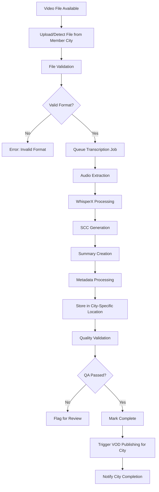
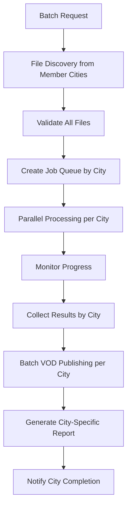
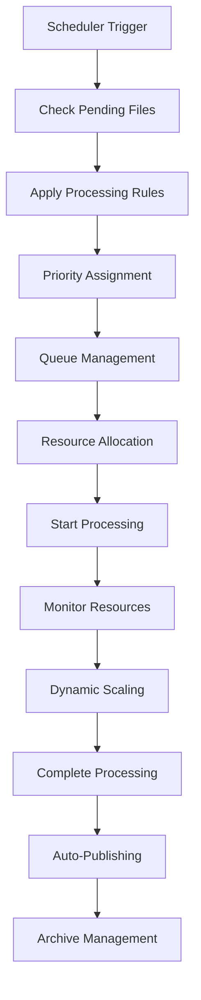
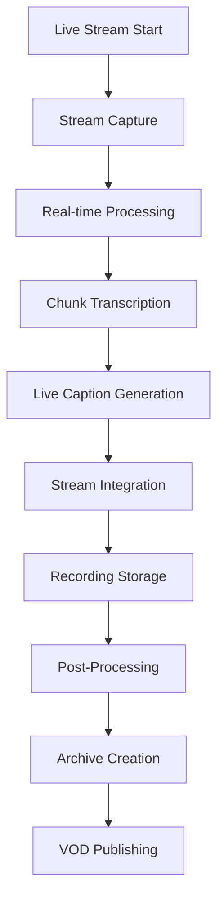
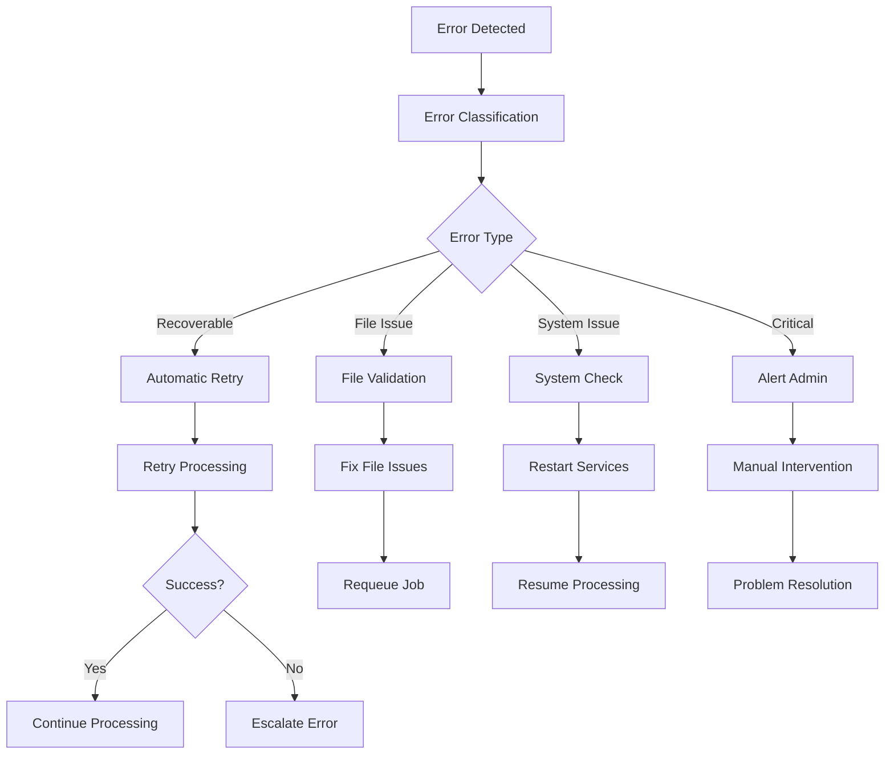

# Workflow Documentation

Comprehensive guide for end-to-end workflows, automated processes, and best practices in the Archivist system.

## 🔄 Core Workflows

### 1. Complete Transcription Workflow



#### Step-by-Step Process

**Phase 1: File Ingestion**
```bash
# 1. File Detection
# System monitors flex servers for new files
# Supported formats: MP4, AVI, MOV, MKV, WMV, MP3, WAV, FLAC

# 2. File Validation
# Check file integrity, format compatibility, and accessibility
ffprobe -v error -select_streams v:0 -show_entries stream=codec_name input.mp4

# 3. Initial Metadata Extraction
# Extract basic file information
ffprobe -v quiet -print_format json -show_format -show_streams input.mp4
```

**Phase 2: Transcription Processing**
```python
# 1. Job Creation
def create_transcription_job(file_path, settings):
    """Create new transcription job"""
    job = Transcription(
        file_path=file_path,
        filename=os.path.basename(file_path),
        language=settings.get('language', 'en'),
        model=settings.get('model', 'large-v2'),
        include_summary=settings.get('include_summary', True),
        status='pending'
    )
    db.session.add(job)
    db.session.commit()
    
    # Queue for processing
    transcribe_audio.delay(job.id)
    return job

# 2. Audio Processing
def process_audio(job_id):
    """Process audio for transcription"""
    job = Transcription.query.get(job_id)
    
    # Extract audio
    audio_path = extract_audio(job.file_path)
    
    # WhisperX transcription
    result = whisperx_transcribe(audio_path, job.language)
    
    # Generate SCC format
    scc_content = generate_scc(result)
    
    # Save outputs
    save_transcription_outputs(job, result, scc_content)
```

**Phase 3: Quality Assurance**
```python
# 1. Content Validation
def validate_transcription(job_id):
    """Validate transcription quality"""
    job = Transcription.query.get(job_id)
    
    # Check SCC format validity
    if not validate_scc_format(job.scc_file_path):
        job.status = 'failed'
        job.error_message = 'Invalid SCC format'
        return False
    
    # Check content length
    if not validate_content_length(job):
        job.status = 'needs_review'
        return False
    
    # Check timestamp accuracy
    if not validate_timestamps(job):
        job.status = 'needs_review'
        return False
    
    return True

# 2. Automated Quality Checks
def quality_assurance_checks(job_id):
    """Automated QA checks"""
    checks = [
        check_file_integrity,
        check_scc_format,
        check_timestamp_accuracy,
        check_content_completeness,
        check_speaker_identification
    ]
    
    for check in checks:
        if not check(job_id):
            return False
    
    return True
```

**Phase 4: VOD Publishing**
```python
# 1. VOD Preparation
def prepare_vod_content(job_id):
    """Prepare content for VOD publishing"""
    job = Transcription.query.get(job_id)
    
    # Generate metadata
    metadata = {
        'title': generate_title(job),
        'description': job.summary or generate_description(job),
        'tags': extract_tags(job),
        'duration': job.duration,
        'captions': job.scc_file_path
    }
    
    return metadata

# 2. Publishing Pipeline
def publish_to_vod(job_id):
    """Publish transcription to VOD platform"""
    job = Transcription.query.get(job_id)
    metadata = prepare_vod_content(job_id)
    
    # Upload to Cablecast
    vod_result = cablecast_client.create_vod(
        video_path=job.file_path,
        metadata=metadata
    )
    
    # Update job with VOD information
    job.vod_id = vod_result['id']
    job.vod_url = vod_result['url']
    job.vod_status = 'published'
    db.session.commit()
    
    return vod_result
```

### 2. Batch Processing Workflow



#### Batch Processing Implementation

```python
# 1. Batch Job Creation
def create_batch_job(file_list, settings):
    """Create batch transcription job"""
    batch_id = str(uuid.uuid4())
    jobs = []
    
    for file_path in file_list:
        job = create_transcription_job(file_path, settings)
        job.batch_id = batch_id
        jobs.append(job)
    
    db.session.commit()
    
    # Start batch processing
    process_batch.delay(batch_id)
    return batch_id, jobs

# 2. Batch Processing Manager
def process_batch(batch_id):
    """Process batch of transcription jobs"""
    jobs = Transcription.query.filter_by(batch_id=batch_id).all()
    
    # Process jobs in parallel
    job_results = []
    for job in jobs:
        result = transcribe_audio.delay(job.id)
        job_results.append(result)
    
    # Wait for completion
    while not all(result.ready() for result in job_results):
        time.sleep(30)
        update_batch_progress(batch_id)
    
    # Collect results
    completed_jobs = []
    failed_jobs = []
    
    for job in jobs:
        if job.status == 'completed':
            completed_jobs.append(job)
        else:
            failed_jobs.append(job)
    
    # Batch VOD publishing for completed jobs
    if completed_jobs:
        batch_publish_vod.delay([job.id for job in completed_jobs])
    
    # Generate batch report
    generate_batch_report(batch_id, completed_jobs, failed_jobs)
```

### 3. Automated Scheduling Workflow



#### Scheduler Implementation

```python
# 1. Scheduled Job Processing
from celery.schedules import crontab
from celery import Celery

app = Celery('archivist')

@app.on_after_configure.connect
def setup_periodic_tasks(sender, **kwargs):
    """Setup periodic tasks"""
    
    # Process pending files every 15 minutes
    sender.add_periodic_task(
        900.0,  # 15 minutes
        process_pending_files.s(),
        name='process_pending_files'
    )
    
    # Auto-publish completed transcriptions hourly
    sender.add_periodic_task(
        crontab(minute=0),
        auto_publish_completed.s(),
        name='auto_publish_completed'
    )
    
    # Archive old files daily at 2 AM
    sender.add_periodic_task(
        crontab(hour=2, minute=0),
        archive_old_files.s(),
        name='archive_old_files'
    )

# 2. Automated File Discovery
@app.task
def process_pending_files():
    """Discover and process new files from member cities"""
    # Member city storage locations
    member_city_mounts = [
        '/mnt/flex-1',  # Birchwood City Council
        '/mnt/flex-2',  # Dellwood Grant Willernie
        '/mnt/flex-3',  # Lake Elmo City Council
        '/mnt/flex-4',  # Mahtomedi City Council
        '/mnt/flex-5'   # Spare Record Storage 1
    ]
    
    for mount_path in member_city_mounts:
        # Find new video files
        new_files = discover_new_files(mount_path)
        
        for file_path in new_files:
            # Check if already processed
            if not is_file_processed(file_path):
                # Create transcription job
                create_transcription_job(file_path, get_default_settings())
                logger.info(f"Queued new file from {get_city_name(mount_path)}: {file_path}")

def get_city_name(mount_path):
    """Get city name from mount path"""
    city_mapping = {
        '/mnt/flex-1': 'Birchwood',
        '/mnt/flex-2': 'Dellwood Grant Willernie',
        '/mnt/flex-3': 'Lake Elmo',
        '/mnt/flex-4': 'Mahtomedi',
        '/mnt/flex-5': 'Spare Record Storage 1',
        '/mnt/flex-6': 'Spare Record Storage 2',
        '/mnt/flex-7': 'Oakdale',
        '/mnt/flex-8': 'White Bear Lake',
        '/mnt/flex-9': 'White Bear Township'
    }
    return city_mapping.get(mount_path, 'Unknown City')

# 3. Automated Publishing
@app.task
def auto_publish_completed():
    """Auto-publish completed transcriptions"""
    if not config.AUTO_PUBLISH_TO_VOD:
        return
    
    # Get completed transcriptions not yet published
    completed = Transcription.query.filter(
        Transcription.status == 'completed',
        Transcription.vod_status.is_(None)
    ).all()
    
    for transcription in completed:
        try:
            publish_to_vod(transcription.id)
            logger.info(f"Auto-published transcription: {transcription.id}")
        except Exception as e:
            logger.error(f"Auto-publish failed for {transcription.id}: {e}")
```

### 4. Live Streaming Workflow



#### Live Stream Processing

```python
# 1. Live Stream Handler
class LiveStreamProcessor:
    def __init__(self, stream_url, output_path):
        self.stream_url = stream_url
        self.output_path = output_path
        self.transcription_buffer = []
        self.live_captions = []
    
    def start_processing(self):
        """Start live stream processing"""
        # Capture stream
        capture_process = self.start_stream_capture()
        
        # Process in chunks
        chunk_processor = self.start_chunk_processing()
        
        # Generate live captions
        caption_generator = self.start_caption_generation()
        
        return capture_process, chunk_processor, caption_generator
    
    def start_stream_capture(self):
        """Capture live stream"""
        cmd = [
            'ffmpeg',
            '-i', self.stream_url,
            '-f', 'segment',
            '-segment_time', '30',
            '-segment_format', 'mp4',
            f'{self.output_path}/chunk_%03d.mp4'
        ]
        
        return subprocess.Popen(cmd)
    
    def start_chunk_processing(self):
        """Process stream chunks for transcription"""
        @app.task
        def process_stream_chunk(chunk_path):
            """Process individual stream chunk"""
            # Extract audio
            audio_path = extract_audio(chunk_path)
            
            # Transcribe chunk
            result = whisperx_transcribe(audio_path, 'en')
            
            # Add to buffer
            self.transcription_buffer.append(result)
            
            # Generate live captions
            captions = generate_live_captions(result)
            self.live_captions.extend(captions)
            
            # Clean up
            os.remove(audio_path)
            
            return result
        
        return process_stream_chunk
    
    def generate_live_captions(self, transcription_result):
        """Generate live captions from transcription"""
        captions = []
        
        for segment in transcription_result['segments']:
            caption = {
                'start': segment['start'],
                'end': segment['end'],
                'text': segment['text'],
                'confidence': segment.get('confidence', 0.0)
            }
            captions.append(caption)
        
        return captions

# 2. Live Caption Integration
def integrate_live_captions(stream_id, captions):
    """Integrate live captions with streaming platform"""
    try:
        # Send to streaming platform
        streaming_api.send_captions(stream_id, captions)
        
        # Store for later processing
        store_live_captions(stream_id, captions)
        
    except Exception as e:
        logger.error(f"Live caption integration failed: {e}")
```

### 5. Error Handling and Recovery Workflow



#### Error Recovery Implementation

```python
# 1. Error Classification
class ErrorClassifier:
    def __init__(self):
        self.error_patterns = {
            'file_not_found': re.compile(r'No such file or directory'),
            'permission_denied': re.compile(r'Permission denied'),
            'disk_full': re.compile(r'No space left on device'),
            'memory_error': re.compile(r'Out of memory'),
            'network_error': re.compile(r'Network unreachable'),
            'format_error': re.compile(r'Invalid format'),
            'timeout_error': re.compile(r'Timeout')
        }
    
    def classify_error(self, error_message):
        """Classify error type"""
        for error_type, pattern in self.error_patterns.items():
            if pattern.search(error_message):
                return error_type
        return 'unknown'

# 2. Automatic Recovery
def handle_transcription_error(job_id, error_message):
    """Handle transcription errors with automatic recovery"""
    job = Transcription.query.get(job_id)
    classifier = ErrorClassifier()
    error_type = classifier.classify_error(error_message)
    
    recovery_actions = {
        'file_not_found': recover_missing_file,
        'permission_denied': fix_permissions,
        'disk_full': cleanup_disk_space,
        'memory_error': restart_with_lower_memory,
        'network_error': retry_with_delay,
        'format_error': convert_file_format,
        'timeout_error': retry_with_longer_timeout
    }
    
    recovery_action = recovery_actions.get(error_type, default_error_handler)
    
    try:
        # Attempt recovery
        recovery_result = recovery_action(job_id)
        
        if recovery_result['success']:
            # Retry processing
            job.status = 'pending'
            job.error_message = None
            job.retry_count += 1
            db.session.commit()
            
            # Requeue job
            transcribe_audio.delay(job_id)
            
        else:
            # Escalate error
            escalate_error(job_id, error_type, error_message)
            
    except Exception as e:
        logger.error(f"Error recovery failed for job {job_id}: {e}")
        escalate_error(job_id, 'recovery_failed', str(e))

# 3. Recovery Actions
def recover_missing_file(job_id):
    """Recover missing file"""
    job = Transcription.query.get(job_id)
    
    # Search for file in alternative locations
    alternative_paths = find_alternative_file_paths(job.filename)
    
    for path in alternative_paths:
        if os.path.exists(path):
            job.file_path = path
            db.session.commit()
            return {'success': True, 'message': f'File found at {path}'}
    
    return {'success': False, 'message': 'File not found in any location'}

def fix_permissions(job_id):
    """Fix file permissions"""
    job = Transcription.query.get(job_id)
    
    try:
        # Fix file permissions
        os.chmod(job.file_path, 0o644)
        
        # Fix directory permissions
        directory = os.path.dirname(job.file_path)
        os.chmod(directory, 0o755)
        
        return {'success': True, 'message': 'Permissions fixed'}
        
    except Exception as e:
        return {'success': False, 'message': f'Permission fix failed: {e}'}

def cleanup_disk_space(job_id):
    """Clean up disk space"""
    try:
        # Clean temporary files
        cleanup_temp_files()
        
        # Clean old log files
        cleanup_old_logs()
        
        # Clean failed transcriptions
        cleanup_failed_transcriptions()
        
        return {'success': True, 'message': 'Disk space cleaned'}
        
    except Exception as e:
        return {'success': False, 'message': f'Cleanup failed: {e}'}
```

## 🔄 Automated Processes

### 1. Content Lifecycle Management

```python
# 1. Automated Content Aging
@app.task
def age_content():
    """Move content through lifecycle stages"""
    
    # Move from Birchwood to Dellwood Grant Willernie (30 days)
    aging_files = find_files_older_than('/mnt/flex-1', days=30)
    for file_path in aging_files:
        move_to_secondary_storage(file_path)
    
    # Move from Dellwood Grant Willernie to Lake Elmo (90 days)
    archival_files = find_files_older_than('/mnt/flex-2', days=90)
    for file_path in archival_files:
        move_to_archive_storage(file_path)
    
    # Clean up old temporary files
    cleanup_old_temp_files()

# 2. Automated Backup
@app.task
def perform_backup():
    """Automated backup operations"""
    
    # Database backup
    backup_database()
    
    # Critical file backup
    backup_critical_files()
    
    # Configuration backup
    backup_configuration()
    
    # Verify backup integrity
    verify_backup_integrity()

# 3. Automated Maintenance
@app.task
def system_maintenance():
    """Automated system maintenance"""
    
    # Clean up completed jobs
    cleanup_completed_jobs()
    
    # Optimize database
    optimize_database()
    
    # Update system statistics
    update_system_statistics()
    
    # Check system health
    perform_health_check()
```

### 2. Quality Assurance Automation

```python
# 1. Automated QA Checks
def automated_quality_checks(job_id):
    """Comprehensive automated QA"""
    
    checks = [
        ('file_integrity', check_file_integrity),
        ('scc_format', validate_scc_format),
        ('timestamp_accuracy', check_timestamp_accuracy),
        ('content_completeness', check_content_completeness),
        ('audio_quality', check_audio_quality),
        ('caption_accuracy', check_caption_accuracy)
    ]
    
    results = {}
    overall_score = 0
    
    for check_name, check_function in checks:
        try:
            result = check_function(job_id)
            results[check_name] = result
            overall_score += result.get('score', 0)
        except Exception as e:
            results[check_name] = {'passed': False, 'error': str(e)}
    
    # Calculate overall quality score
    results['overall_score'] = overall_score / len(checks)
    results['passed'] = overall_score > 0.7  # 70% threshold
    
    return results

# 2. Content Enhancement
def enhance_transcription_content(job_id):
    """Enhance transcription with additional processing"""
    
    job = Transcription.query.get(job_id)
    
    # Speaker identification
    speakers = identify_speakers(job.file_path)
    
    # Topic extraction
    topics = extract_topics(job.content)
    
    # Sentiment analysis
    sentiment = analyze_sentiment(job.content)
    
    # Key phrase extraction
    key_phrases = extract_key_phrases(job.content)
    
    # Update metadata
    metadata = {
        'speakers': speakers,
        'topics': topics,
        'sentiment': sentiment,
        'key_phrases': key_phrases
    }
    
    save_enhanced_metadata(job_id, metadata)
```

### 3. Integration Workflows

```python
# 1. Cablecast Integration Workflow
def cablecast_integration_workflow():
    """Complete Cablecast integration workflow"""
    
    # Sync shows from Cablecast
    sync_cablecast_shows()
    
    # Link completed transcriptions
    link_transcriptions_to_shows()
    
    # Publish to VOD
    publish_linked_content()
    
    # Update metadata
    sync_metadata_back_to_cablecast()
    
    # Generate reports
    generate_cablecast_reports()

# 2. Third-party Integrations
def external_integration_workflow():
    """Handle external system integrations"""
    
    # Send webhooks
    send_pending_webhooks()
    
    # Update external systems
    update_external_systems()
    
    # Import external data
    import_external_data()
    
    # Sync user data
    sync_user_data()
```

## 📊 Best Practices

### 1. Performance Optimization

```python
# 1. Efficient File Processing
def optimize_file_processing():
    """Optimize file processing performance"""
    
    # Batch similar files together
    batch_similar_files()
    
    # Use appropriate chunk sizes
    optimize_chunk_sizes()
    
    # Implement parallel processing
    enable_parallel_processing()
    
    # Cache frequently accessed data
    implement_caching()

# 2. Resource Management
def manage_system_resources():
    """Efficient resource management"""
    
    # Monitor resource usage
    monitor_resources()
    
    # Adjust processing based on load
    dynamic_load_balancing()
    
    # Implement resource pools
    create_resource_pools()
    
    # Schedule resource-intensive tasks
    schedule_heavy_tasks()
```

### 2. Data Management

```python
# 1. File Organization
def maintain_file_organization():
    """Maintain organized file structure"""
    
    # Use consistent naming conventions
    enforce_naming_conventions()
    
    # Organize by date and type
    organize_by_metadata()
    
    # Implement tagging system
    implement_tagging()
    
    # Regular cleanup
    perform_regular_cleanup()

# 2. Metadata Management
def manage_metadata():
    """Comprehensive metadata management"""
    
    # Extract comprehensive metadata
    extract_full_metadata()
    
    # Validate metadata accuracy
    validate_metadata()
    
    # Enrich with external data
    enrich_metadata()
    
    # Index for search
    index_metadata()
```

### 3. Security and Compliance

```python
# 1. Security Workflows
def implement_security_workflows():
    """Implement comprehensive security"""
    
    # Regular security scans
    perform_security_scans()
    
    # Access control audits
    audit_access_controls()
    
    # Encryption management
    manage_encryption()
    
    # Security incident response
    implement_incident_response()

# 2. Compliance Workflows
def ensure_compliance():
    """Ensure regulatory compliance"""
    
    # Data retention policies
    enforce_retention_policies()
    
    # Audit trail maintenance
    maintain_audit_trails()
    
    # Privacy protection
    implement_privacy_protection()
    
    # Compliance reporting
    generate_compliance_reports()
```

## 📈 Monitoring and Alerting

### 1. Performance Monitoring

```python
# 1. Real-time Monitoring
def setup_realtime_monitoring():
    """Setup real-time performance monitoring"""
    
    # System metrics
    monitor_system_metrics()
    
    # Application performance
    monitor_application_performance()
    
    # User experience metrics
    monitor_user_experience()
    
    # Business metrics
    monitor_business_metrics()

# 2. Automated Alerting
def setup_automated_alerting():
    """Setup automated alert system"""
    
    # Define alert thresholds
    define_alert_thresholds()
    
    # Configure alert channels
    configure_alert_channels()
    
    # Implement escalation policies
    implement_escalation_policies()
    
    # Setup alert suppression
    setup_alert_suppression()
```

### 2. Reporting and Analytics

```python
# 1. Automated Reporting
def generate_automated_reports():
    """Generate automated system reports"""
    
    # Daily operations report
    generate_daily_report()
    
    # Weekly performance report
    generate_weekly_report()
    
    # Monthly analytics report
    generate_monthly_report()
    
    # Quarterly business report
    generate_quarterly_report()

# 2. Analytics Dashboard
def maintain_analytics_dashboard():
    """Maintain comprehensive analytics dashboard"""
    
    # Real-time metrics
    display_realtime_metrics()
    
    # Historical trends
    display_historical_trends()
    
    # Predictive analytics
    display_predictive_analytics()
    
    # Custom views
    provide_custom_views()
```

---

**This workflow documentation provides comprehensive guidance for implementing and managing all automated processes in the Archivist system. For specific implementation details, refer to the Technical Documentation and API Reference.** 